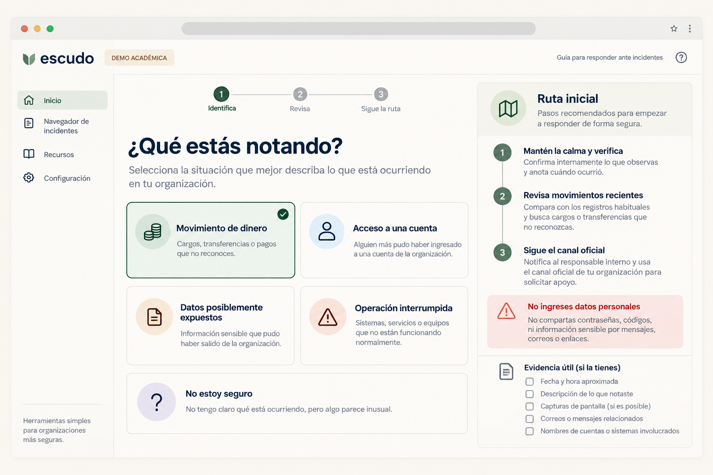
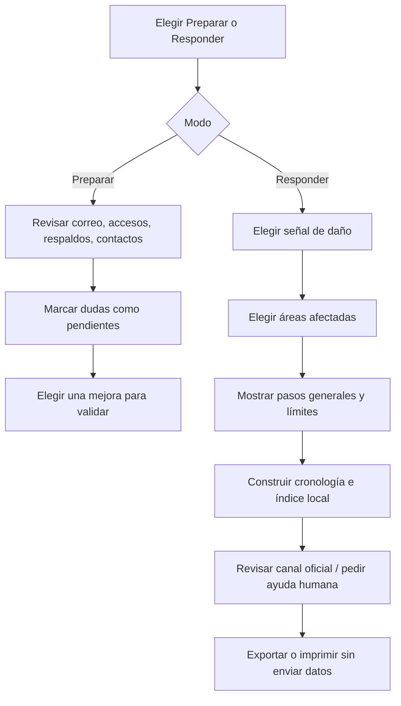
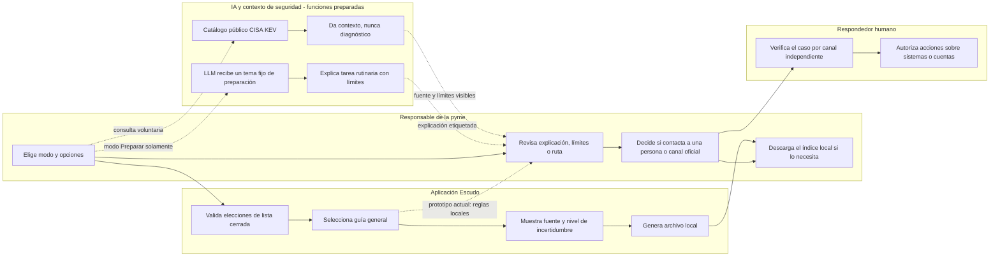

# Packet Escudo SME Shield Week 8

**Estado documental (1 oct 2026):** revisión del packet después de un primer prototipo local. Esta revisión no se presenta como prueba cronológica de «packet antes de código». El modo de incidente usa reglas locales; las funciones LLM/API del modo Preparar están implementadas y probadas con respuestas simuladas en test, pero no se han activado ni comprobado en una URL pública.

## Declaración de producto

SME Shield es la apuesta principal del blueprint del equipo: una capa administrada, en español, para continuidad digital de pequeñas organizaciones mexicanas. Incluye una ruta Breach-Victim cuando aparece un incidente. Este packet aterriza el corte que declaró Rodrigo como USER: identificar el daño, priorizar siguientes pasos, preparar un índice de evidencia no sensible y orientar al siguiente respondedor.

## Usuario y trabajo

**Usuario inicial hipotético:** responsable de operaciones/finanzas de una organización de servicios con trabajo y pagos digitales, sin equipo interno de seguridad.  
**Trabajo:** “Cuando una cuenta, un pago o un sistema deja de estar bajo control, ayúdame a hacer la siguiente acción segura y a llegar al canal adecuado sin volver a construir el caso desde cero.”

El usuario, segmento y trabajo están pendientes de entrevistas. El caso Dromómanos apoya que una persona describió daño financiero inmediato y una recuperación confusa en un caso concreto; no valida esta persona ni el mercado.

**Definición de éxito de este corte:** antes del cierre del módulo, una persona puede completar en la URL pública un escenario inventado de movimiento no reconocido, obtener tres acciones priorizadas, un índice de evidencia y un canal que podría corresponder; puede descargar el resumen sin ingresar datos personales. Una prueba mecánica documenta un defecto, la corrección y un nuevo despliegue. El test de persona documenta dónde duda una usuaria sintética y qué cambió.

## Mockup generado con IA

Concepto generado el 1 de octubre de 2026 para el packet. **Es una propuesta visual, no una captura del producto funcionando.** Prompt final: interfaz web de escritorio en español para Escudo SME Shield, selección de cinco señales de incidente, tarjeta de ruta inicial, advertencia de no ingresar datos personales, estilo SaaS sobrio, sin logos institucionales ni promesas de detección. Generación con la herramienta integrada de imágenes. La implementación puede diferir del mockup.

## Benchmark y visión a tres años

**Benchmark:** [Acronis Cyber Protect Cloud](https://www.acronis.com/es/products/cloud/cyber-protect/) es el referente comercial más cercano que encontramos para una oferta administrada que combina respaldos, seguridad y gestión mediante MSP; «mejor del mundo» no es una clasificación demostrable con las fuentes disponibles. **Diferencia/localización propuesta:** Escudo prioriza para pymes mexicanas sin equipo de seguridad la ruta conversacional posterior al daño, el índice de evidencia mínimo y la conexión a canales mexicanos existentes, sin intentar sustituir las herramientas de protección.

Si este corte funciona y compradores reales pagan por él, en tres años Escudo podría ofrecer una capa administrada de preparación y respuesta que conecte proveedores de TI, continuidad y atención a incidentes. La recomendación automatizada seguiría limitada a tareas rutinarias, con autorización y responsable humano en decisiones de alto impacto. El producto completo necesitaría capacidad operativa, cobertura contractual, medición de resultados y reglas verificables de minimización de datos antes de escalar.

## Propuesta de valor del servicio completo

- **Antes:** onboarding corto, revisión de cuentas y respaldos existentes, indicar qué se conoce/desconoce, priorizar pocas correcciones.
- **Durante operación:** recordatorios y verificación autorizada de acciones preventivas, por ejemplo prueba de restauración.
- **Cuando hay incidente:** triage sencillo, cronología, lista de evidencia, enlaces/rutas oficiales y atención humana según gravedad.

La propuesta vende continuidad y recuperación, no miedo ni un panel técnico. No hay promesa de prevención total, reembolso, ausencia de interrupción ni cumplimiento legal.

## Alcance de esta demo

### Incluye

1. Selector de tipo de daño: dinero movido, acceso tomado, datos posiblemente expuestos, sistemas bloqueados o situación incierta.
2. Contexto de impacto por selección (pagos, correo/identidad, datos de clientes, operación), sin texto libre ni identificadores.
3. Ruta general priorizada con explicación de incertidumbre.
4. Índice de evidencia y cronología plantilla, creados localmente y exportables como texto o imprimibles.
5. Enlaces directos a CONDUSEF y CERT-MX 088 con notas de elegibilidad/alcance; primero se recomienda usar el contacto oficial ya conocido del banco o proveedor relevante.
6. Vista de continuidad previa al incidente con estados “por revisar”; no afirma que se haya revisado ni validado nada.

### No incluye

- Conectar correo, banco, nube, dispositivos o respaldos.
- Solicitar contraseña, PIN, e.firma, estado de cuenta, ID oficial, archivos o lista de clientes.
- Detectar malware, confirmar una brecha, atribuir autoría o decidir responsabilidad.
- Contener automáticamente un incidente, cambiar accesos, borrar datos, restaurar sistemas o enviar una reclamación.
- Dar asesoría legal, asegurar cobertura, ofrecer recuperación de fondos, prometer tiempos/SLA o afirmar que existe demanda.
- IA en decisiones de incidente: el flujo Responder usa reglas declarativas. La IA opcional del modo Preparar solo explica tareas rutinarias mediante una función de servidor, si está configurada; no recibe hechos del incidente.

## Flujo

### Carriles por actor

**Estado del diagrama:** los nodos de IA y fuente pública están implementados para el modo Preparar. CISA KEV se consultó en vivo; la IA solo se probó con respuesta simulada. Vercel marca `GEMINI_API_KEY` como Config/Needs Attention, así que no se ha verificado una respuesta LLM en producción. La IA no participa en la ruta de incidente. Ninguna decisión ni contacto ocurre sin la persona usuaria.

## Arquitectura y pila

| Componente | Función | Estado en este corte | Límite |
|---|---|---|---|
| HTML/CSS/JavaScript estático | Dos modos, navegación y accesibilidad | Implementado localmente | No autentica ni conserva casos |
| Reglas de seguridad locales | Rutas conservadoras por señal | Implementado; no son diagnóstico | Sin detección de malware, fraude o exposición |
| LLM | Explicar tres tareas rutinarias predefinidas de preparación | Función `api/guide.js` y UI implementadas; respuesta simulada en pruebas; configuración Vercel marcada Needs Attention, sin respuesta en vivo verificada | La salida no decide incidentes y se etiqueta como generada por IA |
| Fuente/API de seguridad | Mostrar tres entradas recientes de CISA KEV para un proveedor elegido | Función `api/kev.js` y UI implementadas; consulta pública verificada en la URL de Vercel | Contexto de vulnerabilidades, no escaneo ni prueba de compromiso |
| Automatización local | Construir resumen de selecciones y descargarlo | Implementado | No envía reportes ni evidencia |
| Almacenamiento | Ninguno | Implementado como ausencia deliberada | Cerrar la pestaña descarta estado |

El código reúne los tres componentes previstos: LLM de preparación, fuente de seguridad y exportación automatizada. **Todavía no se ha verificado el Dragon Stack en vivo:** Vercel marca `GEMINI_API_KEY` como Config/Needs Attention; se necesita una clave nueva de tipo Secret para Production y un nuevo despliegue. La clave no se guarda en repositorio; el LLM recibe solo una etiqueta de tema convertida en prompt fijo por el servidor, sin información de la empresa. El catálogo [CISA KEV](https://github.com/cisagov/kev-data) es público y no inspecciona el entorno de la pyme. La función usa el modelo [Gemini 2.5 Flash-Lite](https://ai.google.dev/gemini-api/docs/pricing) previsto para nivel gratuito, sujeto a la disponibilidad y condiciones vigentes del proveedor.

## Plan de pruebas y evidencia esperada

1. **Mecánica:** recorrer los cinco tipos de señal con y sin áreas marcadas, confirmar acciones/rutas correspondientes, exportación local, navegación por teclado y ausencia de entradas libres o tráfico de envío. Registrar un defecto reproducible, corrección y segundo despliegue.
2. **Seguridad:** revisar que el repositorio no incluya secretos ni datos de personas reales; no hay cuentas o tablas en esta versión; comprobar límites de las entradas por ser listas cerradas y que ningún enlace simula contacto automático.
3. **Persona sintética:** usar una conversación nueva con una responsable de operaciones de pyme derivada de la investigación USER, mostrar capturas reales en orden, registrar dudas y corregir la mayor antes del cierre. No sustituye entrevistas con personas reales.
4. **Salida:** confirmar URL pública, código en GitHub, dos despliegues, al menos cinco commits, video de 3 min + 30 s y PDFs del packet, persona y BuildChat. El registro distinguirá evidencia existente de pendientes.

## Criterios de aceptación de la demo

- Una persona puede consultar el modo Preparar y completar el flujo Responder desde teclado o puntero en español.
- El flujo no pide identidad, contacto, texto libre, credenciales ni archivos.
- El resumen exportado contiene solo selecciones, fecha local, pasos y enlaces; no agrega información personal.
- Cada ruta explica que es orientación general y que una persona debe intervenir si el hecho es incierto o de alto impacto.
- El enlace a CONDUSEF explica que debe confirmarse elegibilidad y relación contractual; el enlace a 088 se presenta como orientación para ciberdelito, no garantía de solución.
- Ningún paso contacta automáticamente a bancos, instituciones, proveedores, autoridades o compradores.
- Los estados preventivos empiezan como “por revisar”; la interfaz no muestra “protegido” sin una comprobación real.

## Cómo se medirá el valor si hay piloto

**Métricas tempranas:** tiempo hasta elegir la siguiente acción; si la persona identifica qué sigue desconocido; completitud del índice sin adjuntar archivos; acierto en escenarios revisados por responder humano; comprensión de los límites; derivación a ruta apropiada.

**Métricas de operación:** minutos de onboarding/soporte por organización, acciones prioritarias completadas, tiempo de respuesta humana por severidad, costo variable por cuenta y fallos de derivación. Un flujo más rápido por sí solo no prueba recuperación ni reducción del daño.

**Métricas comerciales:** presupuesto existente, conversión a una oferta explícita, canal de adquisición, CAC, contribución por cuenta y renovación. No medir LTV antes de observar retención.

## Riesgos y controles del diseño

- Recoger lo mínimo; no subir evidencia cruda.
- Mostrar la fuente oficial y distinguirla de la guía del producto.
- No usar “confirmado”, “seguro”, “recuperado” o “protegido” sin evidencia operacional.
- Detenerse y ofrecer respuesta humana ante pérdida de dinero activa, datos sensibles, sistemas críticos, extorsión, dudas sobre quién controla la cuenta o recomendaciones en conflicto.
- No permitir que un partner pagador controle qué canal recomienda el sistema.
- Eliminar estado temporal al cerrar/reiniciar la demo; la exportación ocurre solo por acción explícita de la persona.

## Pendientes de los roles del equipo

- **MONEY:** validar precio, valor comparado con costo de interrupción, límites por nivel y canal con distribución.
- **OPERATOR:** concretar onboarding sin equipo de seguridad, alcance de verificación de respaldos, playbooks, umbrales y capacidad de escalamiento.
- **ADVERSARY:** revisar suplantación del servicio, acceso mínimo, abuso de datos y consecuencias de recomendaciones erróneas.
- **TECHNOLOGIST:** falta su declaración en el PDF de blueprint recibido; incorporar su postura real antes de circular versión final idéntica del equipo.
- **USER:** validar relato de incidentes, siguiente paso seguro, palabras que generan confianza y rutas que realmente utilizaron.

El protocolo para esa validación está en `USER_VALIDATION_PLAN.md`; no contiene resultados inventados.
